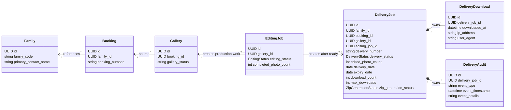

# Delivery Aggregate Diagram



## Boundary Notes

- `DeliveryJob` is the Sprint 7 aggregate root.
- `DeliveryDownload` and `DeliveryAudit` are DeliveryJob-owned child entities.
- `GalleryPhoto` remains owned by Gallery.
- `EditingReview` remains owned by EditingJob.
- Family customer profile fields are not duplicated in DeliveryJob.

## Persistence Notes

Implemented tables:

- `delivery_jobs`
- `delivery_downloads`
- `delivery_audits`

Implemented uniqueness:

```text
unique(delivery_number)
unique(gallery_id)
unique(editing_job_id)
```

