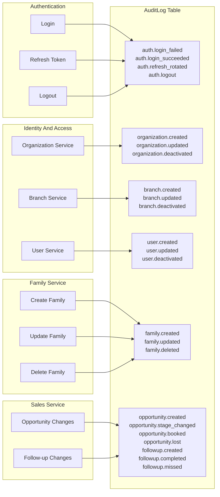

# Domain Event Map

This event map reflects what the current code actually emits. ALRSCRM currently
stores audit events in `audit_logs`; it does not yet implement a domain event
outbox, message bus, or event handlers.

## Implemented Audit Events

## Event Ownership

| Event | Owner | Storage | Transaction Boundary |
| --- | --- | --- | --- |
| `auth.login_failed` | Authentication | `audit_logs` | Auth service commits immediately. |
| `auth.login_succeeded` | Authentication | `audit_logs` | Auth service commits immediately. |
| `auth.refresh_rotated` | Authentication | `audit_logs` | Same transaction as refresh token rotation. |
| `auth.logout` | Authentication | `audit_logs` | Same transaction as refresh token revocation. |
| `organization.created` | Identity | `audit_logs` | Same transaction as organization create. |
| `organization.updated` | Identity | `audit_logs` | Same transaction as organization update. |
| `organization.deactivated` | Identity | `audit_logs` | Same transaction as organization deactivation. |
| `branch.created` | Identity | `audit_logs` | Same transaction as branch create. |
| `branch.updated` | Identity | `audit_logs` | Same transaction as branch update. |
| `branch.deactivated` | Identity | `audit_logs` | Same transaction as branch deactivation. |
| `user.created` | Identity | `audit_logs` | Same transaction as user create. |
| `user.updated` | Identity | `audit_logs` | Same transaction as user update. |
| `user.deactivated` | Identity | `audit_logs` | Same transaction as user deactivation. |
| `family.created` | Family | `audit_logs` | Same transaction as family create. |
| `family.updated` | Family | `audit_logs` | Same transaction as family update. |
| `family.deleted` | Family | `audit_logs` | Same transaction as family soft delete. |
| `opportunity.created` | Sales | `audit_logs` | Same transaction as opportunity create. |
| `opportunity.stage_changed` | Sales | `audit_logs` | Same transaction as opportunity stage update. |
| `opportunity.booked` | Sales | `audit_logs` | Same transaction as stage change to `BOOKED`. |
| `opportunity.lost` | Sales | `audit_logs` | Same transaction as stage change to `LOST`. |
| `followup.created` | Sales | `audit_logs` | Same transaction as follow-up create. |
| `followup.completed` | Sales | `audit_logs` | Same transaction as follow-up completion. |
| `followup.missed` | Sales | `audit_logs` | Same transaction as follow-up status change to `MISSED`. |

## Not Implemented As Events

The current implementation does not emit separate events for:

- Family member added, removed, or updated.
- Family address changed.
- Service interest added, removed, or updated.
- Family status changed.
- Expected delivery date changed.
- Family tag assigned or removed.

Sprint 3 records sales domain events as audit-backed events. There is still no
asynchronous outbox or event bus.

Those state changes are currently covered only by `family.updated` when they happen through `PUT /api/v1/families/{family_id}`.

## Current Event Limitations

- `audit_logs` is an audit store, not a domain event outbox.
- Audit records do not include a schema version.
- Most audit events do not include field-level before/after state.
- There is no `published_at`, retry counter, or idempotency key.
- No current API exposes an activity timeline from `audit_logs`.
