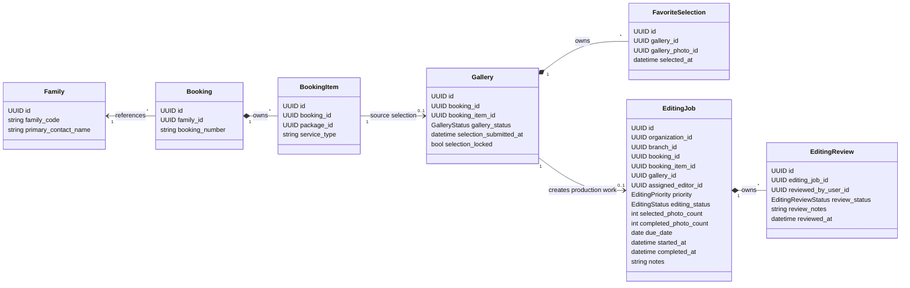

# Editing Aggregate Diagram



## Boundary Notes

- `EditingJob` is the Sprint 6 aggregate root.
- `EditingReview` is owned by EditingJob.
- `Gallery`, `GalleryPhoto`, and `FavoriteSelection` remain in the Gallery
  aggregate.
- `Booking` and `BookingItem` remain in the Booking aggregate.
- `Family` remains the owner of customer profile data.
- `ReadyForDelivery` is represented by `EditingJob.editing_status`, not a
  separate aggregate in Sprint 6.
- One row per selected photo is intentionally not modeled.

## Persistence Notes

Implemented tables:

- `editing_jobs`
- `editing_reviews`

Implemented uniqueness:

```text
unique(gallery_id)
```

Implemented count model:

```text
selected_photo_count
completed_photo_count
```

Recommended indexes:

- `editing_jobs(organization_id, branch_id, editing_status)`
- `editing_jobs(branch_id)`
- `editing_jobs(assigned_editor_id)`
- `editing_jobs(due_date)`
- `editing_reviews(editing_job_id)`
