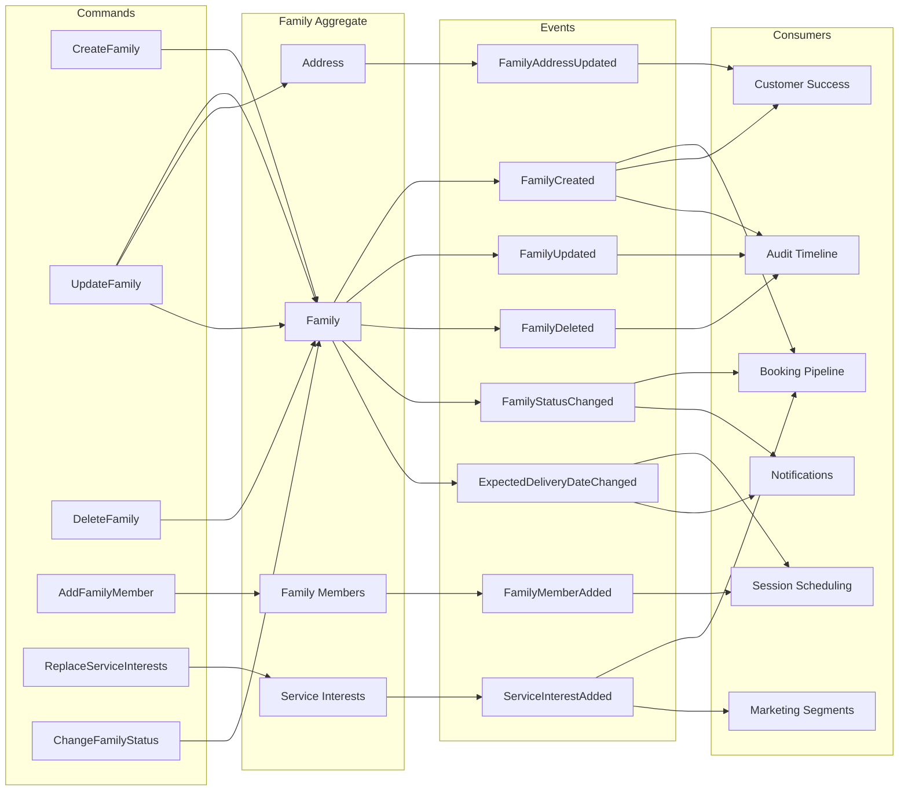

# Family Aggregate Diagram And Domain Event Map

This document is retained for backwards compatibility. The canonical documents
are now:

- `docs/Family_Aggregate_Diagram.md`
- `docs/Domain_Event_Map.md`

The canonical event map distinguishes implemented audit events from future
domain-event vocabulary.

## Family Aggregate

`Family` is the aggregate root for Sprint 2. External modules should reference the aggregate by `family_id` instead of duplicating contact, member, address, or service-interest fields.

```mermaid
classDiagram
    direction LR

    class Organization {
      UUID id
      string name
      string code
      bool is_active
    }

    class Branch {
      UUID id
      UUID organization_id
      string name
      string code
      bool is_active
    }

    class Family {
      UUID id
      UUID organization_id
      UUID branch_id
      string family_code
      string primary_contact_name
      string primary_contact_phone
      string primary_contact_email
      string partner_name
      string partner_phone
      date expected_delivery_date
      LeadSource source
      FamilyStatus status
      datetime deleted_at
    }

    class FamilyMember {
      UUID id
      UUID family_id
      string name
      Relationship relationship
      date date_of_birth
      Gender gender
    }

    class FamilyAddress {
      UUID id
      UUID family_id
      string address_line_1
      string address_line_2
      string city
      string state
      string country
      string postal_code
    }

    class ServiceInterest {
      UUID id
      UUID family_id
      ServiceType service_type
      int priority
      string notes
    }

    class FamilyTag {
      UUID id
      string name
      string description
    }

    class FamilyTagMapping {
      UUID family_id
      UUID tag_id
    }

    Organization "1" --> "*" Branch : owns
    Organization "1" --> "*" Family : scopes
    Branch "1" --> "*" Family : owns intake
    Family "1" *-- "*" FamilyMember : owns
    Family "1" *-- "0..1" FamilyAddress : owns
    Family "1" *-- "*" ServiceInterest : owns
    Family "1" --> "*" FamilyTagMapping : tagged by
    FamilyTag "1" --> "*" FamilyTagMapping : maps
```



## Aggregate Boundary Rules

- `Family` owns lifecycle and consistency for members, address, and service interests.
- `FamilyTag` is outside the aggregate because tags are reusable across families.
- `Organization` and `Branch` are identity/access aggregates referenced by `Family`.
- A family cannot be created for a branch outside its organization.
- A family is deleted by setting `deleted_at`; child records remain retained for historical integrity.
- `family_code` is allocated by the backend and is not client-editable.

## Domain Event Map

Current Sprint 2 implementation records audit events. The events below define the domain event vocabulary future modules should consume when an event bus or outbox is introduced.



## Event Catalog

| Event | Trigger | Primary Payload | Expected Consumers |
| --- | --- | --- | --- |
| `FamilyCreated` | New family is created | `family_id`, `organization_id`, `branch_id`, `family_code`, `status`, `source` | Booking, Customer Success, Audit |
| `FamilyUpdated` | Profile fields change | `family_id`, changed fields | Audit, Customer Success |
| `FamilyDeleted` | Family is soft-deleted | `family_id`, `deleted_at`, `deleted_by` | Audit, reporting exclusions |
| `FamilyMemberAdded` | Member is added to aggregate | `family_id`, `member_id`, `relationship` | Session planning, Customer Success |
| `FamilyAddressUpdated` | Address is created or changed | `family_id`, `address_id`, city/state/country | Customer Success |
| `ServiceInterestAdded` | Service interest is added | `family_id`, `service_type`, `priority` | Booking, marketing segmentation |
| `FamilyStatusChanged` | Status changes | `family_id`, `old_status`, `new_status` | Booking, notifications, reporting |
| `ExpectedDeliveryDateChanged` | EDD changes | `family_id`, `old_edd`, `new_edd` | Scheduling, notifications |

## Current Implementation Mapping

| Domain Event | Current Audit Event |
| --- | --- |
| `FamilyCreated` | `family.created` |
| `FamilyUpdated` | `family.updated` |
| `FamilyDeleted` | `family.deleted` |

Sprint 2 does not yet persist a formal domain-event outbox. Until that exists, backend services should continue recording audit events inside the same transaction as aggregate mutations.

## Future Outbox Shape

```text
domain_events
- id
- aggregate_type
- aggregate_id
- event_type
- payload
- occurred_at
- published_at
- retry_count
```

Recommended constraints:

- `aggregate_type`, `aggregate_id`, and `occurred_at` indexed for timeline reads.
- `published_at IS NULL` indexed for event publisher polling.
- Event payload version included in `payload` as `schema_version`.
