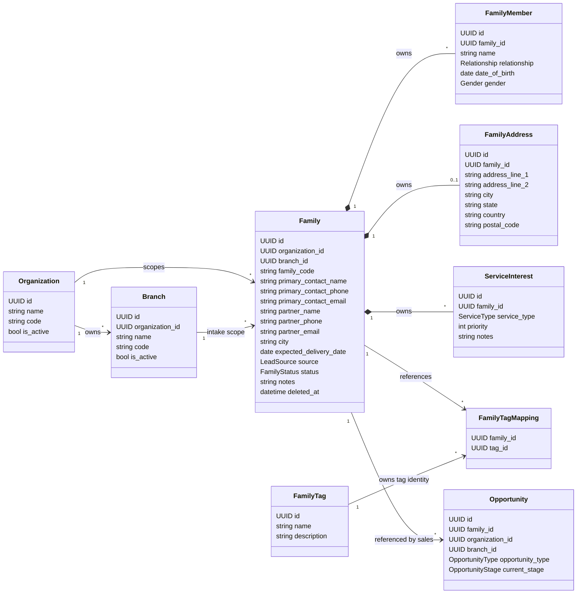

# Family Aggregate Diagram

This diagram reflects the current Sprint 2 implementation and database schema.
It separates aggregate ownership from references to other aggregates.

## Current Aggregate Boundary

## Boundary Classification

| Entity | Boundary | Reason |
| --- | --- | --- |
| `Family` | Aggregate root | Owns family lifecycle, soft delete, phone uniqueness, generated code, and child collection replacement. |
| `FamilyMember` | Inside Family aggregate | Owned by `Family`; no independent API or lifecycle. |
| `FamilyAddress` | Inside Family aggregate | One address per family; no independent API or lifecycle. |
| `ServiceInterest` | Inside Family aggregate | Owned by `Family`; no independent API or lifecycle. |
| `FamilyTag` | Outside Family aggregate | Reusable tag identity; modeled as its own table. No API exists yet. |
| `FamilyTagMapping` | Association | Connects Family to external reusable tags. |
| `Opportunity` | Separate Sales aggregate | References `family_id`; does not own Family profile fields. |
| `Organization` | Separate Identity aggregate | Existing Sprint 1 aggregate used for tenant scope. |
| `Branch` | Separate Identity aggregate | Existing Sprint 1 aggregate used for branch scope. |

## Implemented Invariants

- `Family.family_code` is globally unique and generated by the backend.
- `Family.primary_contact_phone` is globally unique.
- `Family.branch_id` must belong to the same `organization_id`.
- `Family.deleted_at` implements soft delete.
- Family members, address, and service interests are written through Family APIs.

## Entities Not In The Family Aggregate

- `Organization`
- `Branch`
- `User`
- `Role`
- `Permission`
- `RefreshTokenSession`
- `AuditLog`
- `FamilyTag`
- `Opportunity`

These entities either belong to Identity and Access, Authentication, Audit, or reusable taxonomy boundaries.
