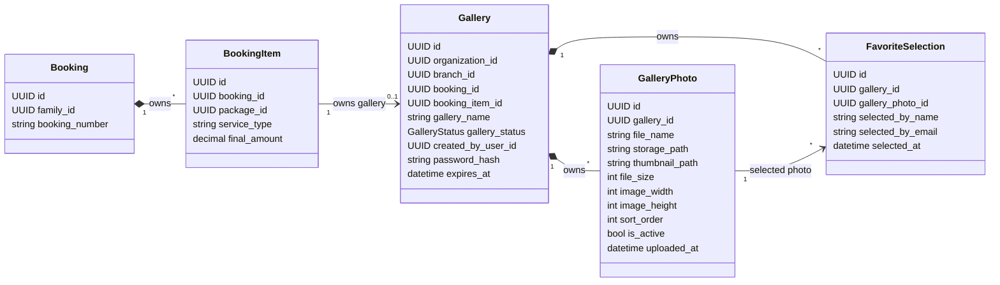

# Gallery Aggregate Diagram

## Boundary Notes

- `Gallery` is the aggregate root for Sprint 5.
- `GalleryPhoto` and `FavoriteSelection` do not have independent lifecycles.
- `BookingItem` remains in the Booking domain and is referenced by Gallery.
- Family customer profile data is not stored in Gallery tables.
